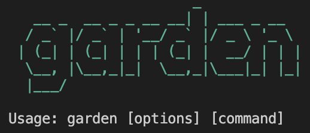

# Garden Scripts [![npm version][npm version badge]][npm version link] [![Build Status][build status badge]][build status link] [![Dependency Status][dependency status badge]][dependency status link]<!-- markdownlint-disable -->

<!-- markdownlint-enable -->

[npm version badge]: https://flat.badgen.net/npm/v/@zendeskgarden/scripts
[npm version link]: https://www.npmjs.com/package/@zendeskgarden/scripts
[build status badge]: https://flat.badgen.net/circleci/github/zendeskgarden/scripts/main?label=build
[build status link]: https://circleci.com/gh/zendeskgarden/scripts/tree/main
[dependency status badge]: https://flat.badgen.net/david/dev/zendeskgarden/scripts?label=dependencies
[dependency status link]: https://david-dm.org/zendeskgarden/scripts?type=dev

> :seedling: Garden is the design system by Zendesk

This repo contains a set of CLI scripts leveraged throughout Garden
repositories for common tasks and CI automation.



## Installation

```sh
npm install --save-dev @zendeskgarden/scripts
```

... or for one-off execution

```sh
npx --package @zendeskgarden/scripts garden [command]
```

## Usage

All commands are available via the `garden` executable. Commands may be
chained so that the output from one command provides input to another. Each
command also provides a functional equivalent for programmatic usage. See
the individual command README for details.

- [`garden cmd-docgen`](src/cmd/docgen#readme)
- [`garden cmd-du`](src/cmd/du#readme)
- [`garden github-branch`](src/github/branch#readme)
- [`garden github-commit`](src/github/commit#readme)
- [`garden github-deploy`](src/github/deploy#readme)
- [`garden github-pages`](src/github/pages#readme)
- [`garden github-release`](src/github/release#readme)
- [`garden github-repository`](src/github/repository#readme)
- [`garden github-token`](src/github/token#readme)
- [`garden lerna-changelog`](src/lerna/changelog#readme)
- [`garden lerna-new`](src/lerna/new#readme)
- [`garden netlify-bandwidth`](src/netlify/bandwidth#readme)
- [`garden netlify-deploy`](src/netlify/deploy#readme)
- [`garden netlify-site-id`](src/netlify/site_id#readme)
- [`garden netlify-token`](src/netlify/token#readme)

Command environment variables may be provided by a project-level
[`.env`](https://www.npmjs.com/package/dotenv) file.

## Contribution

Thanks for your interest in Garden! Community involvement helps make our
design system fresh and tasty for everyone.

Got issues with what you find here? Please feel free to create an
[issue](https://github.com/zendeskgarden/scripts/issues/new).

Community behavior is benevolently ruled by a [code of
conduct](.github/CODE_OF_CONDUCT.md). Please participate accordingly.

## License

Copyright 2021 Zendesk

Licensed under the [Apache License, Version 2.0](LICENSE.md)
